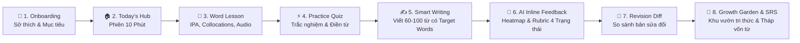
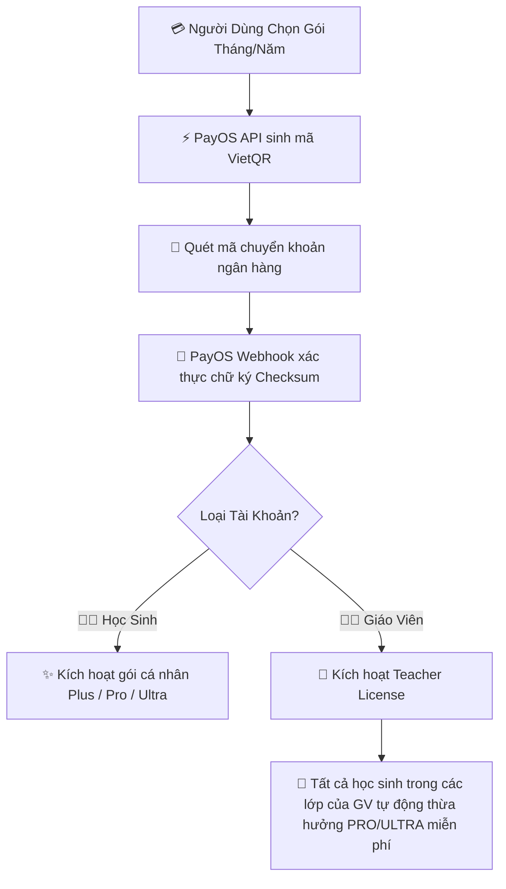

<div align="center">

# 🌿 LexiGrow
### *Hệ Thống Học Tập & Phát Triển Vốn Từ Vựng Tiếng Anh Tích Hợp AI Phân Tích Bài Viết & Phản Hồi Thông Minh*

<p align="center">
  <a href="https://github.com/ekancisme/lexigrow">
    
  </a>
</p>

[](https://opensource.org/licenses/MIT)
[](https://react.dev/)
[](https://vitejs.dev/)
[](https://nodejs.org/)
[](https://www.mongodb.com/)
[](https://deepmind.google/technologies/gemini/)
[](https://vitest.dev/)

<p align="center">
  
</p>

</div>

## 🌟 Giới Thiệu Tổng Quan (Introduction)

**LexiGrow** là nền tảng học tập tiếng Anh đột phá, được thiết kế xoay quanh triết lý **"Học từ qua ngữ cảnh ➔ Vận dụng trong bài viết thực tế ➔ AI đánh giá & sửa đổi ➔ Chuyển dịch thành vốn từ chủ động (Active Mastery)"**.

Thay vì chỉ học từ vựng thụ động qua danh sách rời rạc hoặc thẻ từ thông thường, LexiGrow cung cấp **Chuỗi Học Tập Vi Mô 10 Phút (Micro-Learning Loop)** dẫn dắt người học qua từng bước tương tác khoa học, giúp người học chuyển hóa từ nhận biết cơ bản sang khả năng tự sản sinh câu chữ chuẩn xác trong các bài văn bản thực tế.

---

## 🚀 Chuỗi Học Tập Vi Mô 8 Bước (The 8-Step Micro-Learning Loop)



### ✨ 8 Chặng Khám Phá:
1. **🌟 Onboarding & Thiết lập Cá nhân hóa**: Lựa chọn chủ đề yêu thích (Daily Life, Travel, Hobbies, Technology, Business), trình độ mục tiêu CEFR (A2, B1, B2) và mục tiêu thời gian (5, 10, 15 phút/ngày).
2. **🏠 Today's Hub (Hôm nay)**: Thẻ hành động nhanh mở ngay phiên học 3 từ mục tiêu trong ngày kèm theo dõi Streak và các thẻ SRS đến hạn.
3. **📖 Khám phá Từ vựng Ngữ cảnh**: Phát âm audio trực tiếp qua Web Speech API, hiển thị IPA, collocations thiết yếu và câu ví dụ song ngữ.
4. **⚡ Luyện tập Tương tác Tức thì**: Câu hỏi trắc nghiệm & điền từ vào ngữ cảnh câu với phản hồi thời gian thực và chuỗi trả lời đúng liên tiếp (Streak Multiplier).
5. **✍️ Không gian Viết Thông Minh (Smart Writing)**: Đoạn văn ngắn 60–100 từ với thanh Chip Target Words tự động đổi trạng thái xanh khi người học gõ từ vào khung soạn thảo.
6. **🤖 Phân tích AI Đa chiều (Structured Rubric)**: Kiểm tra chéo qua Google Gemini theo 4 mức độ:
   - 🟢 `correct` — Sử dụng đúng ngữ cảnh, đúng ngữ pháp và loại từ.
   - 🟡 `needs_improvement` — Dùng được từ nhưng sai collocation, giới từ hoặc dạng từ.
   - 🔴 `incorrect` — Dùng sai nghĩa hoặc ngữ cảnh nghiêm trọng.
   - ⚪ `not_used` — Chưa đưa từ vào bài viết.
7. **🔄 So sánh Bản sửa đổi (Revision Comparison)**: Xem song song (Side-by-side Diff) giữa Bản nháp 1 và Bản sửa 2, ghi nhận các lỗi đã được giải quyết.
8. **🌳 Khu vườn Sinh thái (Growth Garden) & Tháp Vốn từ**: Cây tri thức lớn dần từ *Hạt giống ➔ Nảy mầm ➔ Cành lá ➔ Nở hoa* tương ứng với số từ đạt trạng thái **Mastered** (được viết đúng trong ≥ 2 bài viết ở các ngày khác nhau).

---

## 🎨 Điểm Nhấn Thiết Kế & Trải Nghiệm (UI/UX Highlights)

<div align="center">

| 🎨 Material 3 Tokens | ⚡ Tương Tác Trực Quan | 📊 Dữ Liệu Rõ Ràng |
| :---: | :---: | :---: |
| Bảng màu xanh dương hiện đại kết hợp Glassmorphism thanh lịch | Thanh tiến trình, âm thanh phát âm, hiệu ứng lật thẻ 3D | Tháp 3 tầng phân định ranh giới giữa *Saved ➔ Retained ➔ Mastered* |

</div>

- **Tháp Tăng Trưởng Vốn Từ Chủ Động (Active Vocabulary Pyramid)**:
  - **Bậc 1 — Đã lưu (Saved)**: Từ mới có trong kho hoặc thư viện cá nhân.
  - **Bậc 2 — Ghi nhớ Dài hạn (Retained - SRS)**: Từ đã vượt qua các mốc ôn tập Spaced Repetition (khoảng cách $\ge 7$ ngày).
  - **Bậc 3 — Đã làm chủ (Mastered)**: Từ đã được người học vận dụng đúng trong $\ge 2$ bài viết thực tế độc lập.
- **Bức Tường Bằng Chứng Vận Dụng (Evidence Wall)**: Lưu trữ các câu văn thật của học sinh được AI chứng thực độ tin cậy.

---

## 🛠️ Kiến Trúc Công Nghệ (Tech Stack)

```
                       ┌─────────────────────────────────────┐
                       │          LexiGrow Client            │
                       │   React 19 + Vite 8 + CSS Tokens   │
                       └──────────────────┬──────────────────┘
                                          │ REST API / JWT
                       ┌──────────────────▼──────────────────┐
                       │          LexiGrow Server            │
                       │     Node.js + Express + MongoDB     │
                       └──────┬───────────────────────┬──────┘
                              │                       │
               ┌──────────────▼──────┐         ┌──────▼──────────────┐
               │    Google Gemini    │         │  SM-2 Spaced Rep.   │
               │ Structured JSON AI  │         │  Learning Sessions  │
               └─────────────────────┘         └─────────────────────┘
```

### 💻 Frontend:
- **Core**: React 19, React Router DOM v7, Vite 8
- **Design System**: Material Design 3 Tokens, Glassmorphism, CSS Transitions & Responsive Grid
- **Charts & Motion**: Chart.js, Canvas Confetti, Web Speech Synthesis API

### ⚙️ Backend:
- **Core**: Node.js v20, Express, MongoDB & Mongoose Transactions
- **AI Intelligence**: Google Gemini API (Structured Output JSON Schema), Groq Llama Integration
- **Algorithms & Security**: Thuật toán SM-2 SRS, Token Cost Logging (`AILog`), Anti-Hallucination Quote Verifier, Sliding Window Rate Limiter
- **Testing**: Vitest, Supertest (100% Pass, 174 Tests)

---

## 👥 Vai Trò Người Dùng Trong Hệ Thống (User Roles)

- 🎓 **Học sinh (Student)**: Trải nghiệm chuỗi học 10 phút, làm trắc nghiệm ngữ cảnh, viết bài nhận AI chấm điểm, chăm sóc khu vườn tiến bộ và ôn thẻ Flashcard.
- 👨‍🏫 **Giáo viên (Teacher)**: Quản lý lớp học, giao bài tập gắn kèm bộ từ vựng mục tiêu, theo dõi bản đồ nhiệt lỗi dùng từ (Lexical Errors Heatmap) và cảnh báo học sinh chậm tiến độ.
- 👨‍👩‍👧 **Phụ huynh (Parent)**: Liên kết tài khoản con qua mã bảo mật, theo dõi thời gian học thực tế, biểu đồ tăng trưởng vốn từ và nhận thông báo cảnh báo sớm.
- 🛡️ **Quản trị viên (Admin)**: Giám sát toàn bộ hệ thống, điều phối mức tiêu thụ token AI, phê duyệt tài khoản giáo viên và theo dõi Audit Logs.

## 💎 Bảng Giá Dịch Vụ & Thanh Toán PayOS (Pricing & Subscription Plans)

LexiGrow cung cấp mô hình đăng ký SaaS linh hoạt với cổng thanh toán trực tuyến **PayOS (VietQR Chuẩn Ngân Hàng)**, hỗ trợ cả tài khoản cá nhân cho **Học sinh** lẫn gói bản quyền bảo trợ cho **Giáo viên & Lớp học**.



### 1. 🎓 Gói Dành Cho Học Sinh (Student Plans)

| Tính Năng & Quyền Lợi | 🟢 Miễn Phí (Free) | ⚡ Plus | 🌟 Pro (Phổ Biến Nhất) | 👑 Ultra (VIP) |
| :--- | :---: | :---: | :---: | :---: |
| **Giá theo Tháng** | **0đ** | **49.000đ** / tháng | **99.000đ** / tháng | **199.000đ** / tháng |
| **Giá theo Năm (-20%)** | **0đ** | **490.000đ** / năm | **990.000đ** / năm | **1.990.000đ** / năm |
| **Lượt Chấm Bài AI / Ngày** | 3 bài / ngày | 15 bài / ngày | 🚀 **Không giới hạn** | 🚀 **Không giới hạn** |
| **Kho Từ Vựng & Flashcard SRS** | Cơ bản A2 | Toàn bộ A2 – B1 | Toàn bộ A2 – B2+ | Mọi trình độ + IELTS/TOEFL |
| **Khu Vườn Tri Thức & Tháp Từ** | 1 Khu vườn | Không giới hạn | Không giới hạn | Không giới hạn |
| **AI Phân Tích Chuyên Sâu 1-on-1** | ❌ | ❌ | ❌ | ✅ **Ưu tiên phản hồi cao cấp** |
| **Huy Hiệu Hồ Sơ (Badge)** | Free | `PLUS` | `PRO` | `ULTRA` |

---

### 2. 👨‍🏫 Gói Bảo Trợ Dành Cho Giáo Viên (Teacher Sponsorship License)

> [!TIP]
> **Cơ Chế Bảo Trợ Học Sinh Độc Quyền**: Khi Giáo viên đăng ký gói dịch vụ, **toàn bộ học sinh** được ghi danh vào bất kỳ lớp học nào của giáo viên đó sẽ **tự động được sử dụng toàn bộ tính năng cao cấp (Pro/Ultra)** mà **không cần phải mua gói cá nhân**!

| Gói Bản Quyền Giáo Viên | ⚡ Teacher Plus | 🌟 Teacher Pro | 👑 Teacher Ultra |
| :--- | :---: | :---: | :---: |
| **Giá theo Tháng** | **199.000đ** / tháng | **499.000đ** / tháng | **999.000đ** / tháng |
| **Giá theo Năm (-20%)** | **1.990.000đ** / năm | **4.990.000đ** / năm | **9.990.000đ** / năm |
| **Số Lượng Học Sinh Được Bảo Trợ** | 🎓 **30 Học sinh** | 🎓 **100 Học sinh** | 🎓 **300+ Học sinh** |
| **Số Lớp Học Tối Đa** | 3 Lớp học | 10 Lớp học | 🚀 Không giới hạn |
| **Quyền Lợi Cho Học Sinh Trong Lớp** | Thừa hưởng gói **PLUS** | Thừa hưởng gói **PRO** (Full AI) | Thừa hưởng gói **ULTRA** |
| **Báo Cáo Tiến Độ & Heatmap Lớp** | Cơ bản | Nâng cao | Chuyên sâu & Xuất dữ liệu Excel |

---

### 3. 🛡️ Quản Trị Bảng Giá & Doanh Thu (Admin Dynamic Pricing)
- **Đường dẫn**: `/admin/pricing`
- **Chức năng Admin**:
  - Tùy chỉnh giá tháng, giá năm, số lượng quota học sinh bảo trợ và bật/tắt hiển thị gói cước theo thời gian thực.
  - Theo dõi tổng doanh thu, tỷ lệ chuyển đổi và danh sách giao dịch VietQR qua PayOS.
  - Cấp quyền đăng ký thủ công (Grant Subscription) linh hoạt theo mã người dùng.

---

<div align="center">

<p align="center">
  
</p>

**LexiGrow © 2026** — *Empowering English Vocabulary Mastery Through Measured Writing Growth.*

Developed with ❤️ by **ekancisme**

</div>
