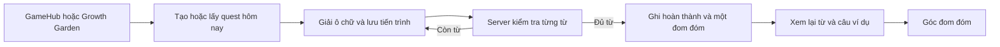

# Daily Word Quest — bản triển khai

## Cách mở

Đăng nhập bằng tài khoản học sinh, vào khu trò chơi và chọn **Giải ô chữ hôm nay**. Route: `/student/game/daily-quest`. Trong `/student/garden` cũng có thẻ **Góc đom đóm** để mở game và xem bộ sưu tập.

## Hành vi đã triển khai

- Một ô chữ cố định cho mỗi học sinh mỗi ngày, đổi lúc 00:00 theo `Asia/Ho_Chi_Minh`. MVP dùng chung múi giờ này, không thay đổi theo thiết lập người dùng.
- Mục tiêu sáu từ (tối thiểu năm với bộ dự phòng), mỗi từ 3–10 chữ cái A–Z. Lưới tối đa 11 × 11, không giới hạn thời gian chơi.
- Lấy từ đến hạn SRS trước, sau đó từ mới lưu, thư viện theo trình độ và bộ từ dự phòng có gợi ý song ngữ. Chuẩn hóa, bỏ từ trùng/cụm từ và che đáp án trong gợi ý.
- Thuật toán tìm kiếm có giới hạn lượt thử. Dùng bộ dự phòng nếu dữ liệu cá nhân không tạo được lưới đủ năm từ. Nội dung được chụp lại trong quest, không đổi khi thư viện bị chỉnh sửa.
- Component React tự xây, không thêm game engine hoặc dependency crossword; tách lưới hiển thị khỏi thuật toán server. Màn chơi được lazy-load.
- Chọn gợi ý, nhập cả từ vào ô lớn; Enter để kiểm tra, phím lên/xuống để chuyển gợi ý. Có câu ví dụ nếu dữ liệu nguồn cung cấp, và chức năng hiện đáp án được ghi nhận riêng.
- Server kiểm tra từng từ. Các ô thuộc từ đã giải được giữ nguyên. Đáp án đầy đủ chỉ trả về khi hoàn thành; thao tác hiện đáp án trả về chữ của từ được chọn.
- Tự lưu sau 800 ms ngừng gõ. Bản nháp trong sessionStorage hỗ trợ phục hồi khi tải lại cùng tab; chỉ dùng khi revision trùng server. Đây không phải chế độ offline đầy đủ.
- Khi request lỗi, giữ bản nháp và hiện nút thử lại. Khi revision xung đột, dừng ghi và yêu cầu tải tiến trình mới nhất. Quest chưa hoàn thành của ngày cũ không thể tiếp tục; bản hoàn thành vẫn trả lại kết quả nếu request cũ được gửi lại.
- Hoàn thành tự nhận một đom đóm. Tổng bộ sưu tập được tính từ các quest đã nhận thưởng, không có thao tác cập nhật ví thứ hai.
- Không ghi vào SRS, masteryLevel hoặc số từ Mastered của Growth Garden. Đom đóm là vật phẩm trang trí độc lập.
- Giao diện Việt/Anh, hỗ trợ theme hiện có, reduced motion, thông báo lỗi và trạng thái lưu. Gợi ý lấy từ thư viện vẫn có thể là tiếng Anh vì model hiện tại chưa có trường dịch tiếng Việt.

## API và dữ liệu

Tất cả endpoint yêu cầu JWT và vai trò `student`, giới hạn 180 request/phút/học sinh.

| Endpoint | Chức năng |
| --- | --- |
| `GET /api/daily-quests/summary` | Số đom đóm và trạng thái quest hôm nay; không tạo quest |
| `POST /api/daily-quests/today` | Tạo hoặc trả lại quest hôm nay |
| `POST /api/daily-quests/:id/play` | `{ action: 'save' \| 'check' \| 'hint', revision, cells, wordId? }` |

`cells` ánh xạ tọa độ `row,col` sang một chữ A–Z. Chỉ nhận tọa độ thuộc puzzle. `wordId` bắt buộc khi kiểm tra hoặc hiện đáp án.

Collection `dailyquests` có unique index `(student, day)`. Server khởi tạo index trong `server/src/index.js` trước khi lắng nghe request. Cập nhật tiến trình dùng compare-and-set theo `revision`; kết quả hoàn thành và `reward: 1` được ghi cùng một thao tác MongoDB trên một document.

- 400: dữ liệu không hợp lệ.
- 401/403: thiếu phiên hoặc không phải học sinh.
- 404: không tìm thấy quest thuộc học sinh hiện tại.
- 409 `QUEST_CONFLICT`: tiến trình đã được tab/request khác cập nhật.
- 410 `QUEST_EXPIRED`: quest chưa hoàn thành đã qua ngày.

Không cần migration dữ liệu cũ, không cần API key mới. Cần khởi động lại backend để đăng ký route/index mới và build lại frontend khi triển khai.



## Kiểm chứng

Từ thư mục gốc:

```powershell
npm run build
node server/scripts/smokeDailyQuest.mjs
```

Trong thư mục `server`:

```powershell
npm test
```

- `crossword.test.js`: chuẩn hóa/che đáp án, ngày Việt Nam, tính ổn định, kết nối, lưới hợp lệ trên 30 seed và dữ liệu không phù hợp.
- `dailyQuest.test.js`: dùng MongoDB tạm thực để kiểm tra quyền truy cập, tạo đồng thời, lưu/khôi phục, revision cũ, đáp án/gợi ý, nhận thưởng đồng thời, retry và bảo toàn SRS/mastery.
- `smokeDailyQuest.mjs`: dùng database và tài khoản tạm riêng; khởi động app đã build trên cổng ngẫu nhiên, chạy Chromium headless, kiểm tra mobile/desktop, tải lại, mất mạng/retry, xung đột hai tab, nhập chữ ở ô giao nhau, giải hết và bộ sưu tập. Tự đóng browser/server/database sau khi chạy.
- Script browser dùng Puppeteer có sẵn trong dự án. MongoDB binary và Chromium cần có sẵn hoặc được tải trong lần chạy đầu. Ảnh mặc định lưu trong thư mục tạm `lexigrow-daily-quest`; có thể đặt `QUEST_SMOKE_OUTPUT` để đổi nơi lưu.

Kết quả kiểm chứng trong lần triển khai: 27 test files / 186 test passed, production build thành công và browser smoke passed. Build vẫn báo bundle chính trên 500 kB; chunk game mới khoảng 3.3 kB gzip.

Lint tất cả file JS/JSX mới của tính năng và test mới đã pass. Lệnh lint toàn repository vẫn còn lỗi ở mã có sẵn (bao gồm cấu hình globals Node và các cảnh báo React/biến không dùng); các lỗi ngoài phạm vi này không được sửa trong tính năng.

## Đo lường và giới hạn MVP

Đã lưu `createdAt`, `startedAt`, `completedAt`, số lần kiểm tra, danh sách từ có xem đáp án và nguồn từ để phân tích cơ bản. Chưa có dashboard analytics, impression tracking, thử nghiệm cohort hay kiểm chứng tác động đến khả năng nhớ từ.

Chưa có AI sinh gợi ý, phân tích lỗi bài viết để chọn từ, bài viết một câu sau game, âm thanh, nhiệm vụ nhiều ngày, cửa hàng hay PvP. Có thể mở rộng các phần này sau khi quan sát dữ liệu sử dụng.

## Hoàn tác

Gỡ route và thẻ frontend, bỏ đăng ký `/api/daily-quests` ở backend và bỏ `DailyQuest` trong danh sách khởi tạo index. Collection mới có thể giữ nguyên để bảo toàn dữ liệu nếu bật lại; không cần sửa collection học tập cũ. Không tự xóa dữ liệu khi rollback.
