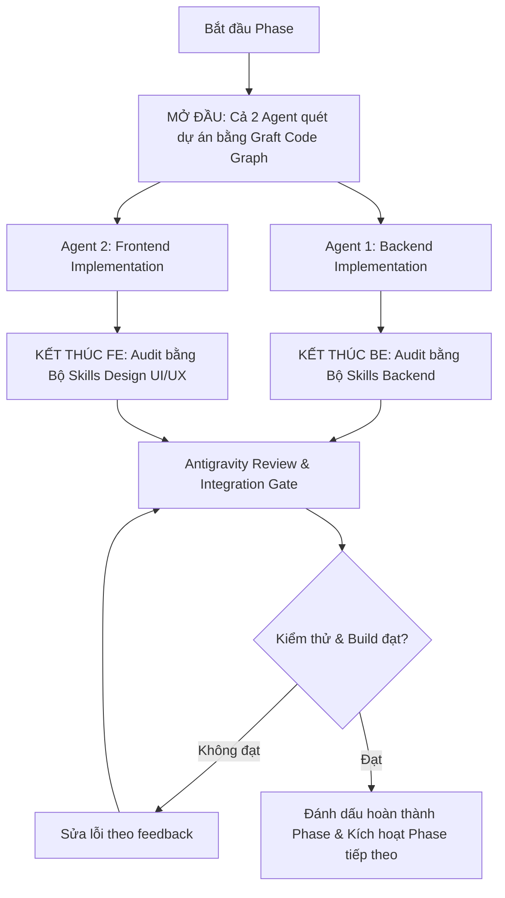

# LexiGrow — Dual-Agent Execution Framework & Prompts (`todoAgent.md`)

> **Mục tiêu:** Phân chia công việc theo từng Phase cho **2 Subagents (Frontend Agent & Backend Agent)** chạy song song độc lập.
> - **Mở đầu mỗi Phase:** Cả 2 Agent bắt buộc quét lại dự án bằng **Graft Code Graph** để định tuyến mã nguồn siêu nhanh và tiết kiệm tokens.
> - **Kết thúc mỗi Phase:** 
>   - **Frontend Agent:** Tự kích hoạt và rà soát lại toàn diện bằng **Bộ Skills Design UI/UX** (`ui-ux-pro-max`, `design-taste-frontend`, `high-end-visual-design`, `frontend-ui-engineering`, `gsap-react`).
>   - **Backend Agent:** Tự kích hoạt và rà soát lại toàn diện bằng **Bộ Skills Backend** (`api-and-interface-design`, `security-and-hardening`, `performance-optimization`, `test-driven-development`, `code-review-and-quality`).
> - **Cuối cùng:** **Antigravity AI** thực hiện tầng Review Gate tổng hợp, Verification & Merge.

---

## 🧭 1. Quy chuẩn Mở đầu: Quét dự án bằng Graft Code Graph

Mở đầu **mỗi Phase** và trước khi viết bất kỳ dòng code nào, các Agent **BẮT BUỘC** thực hiện quy trình quét dự án bằng Graft MCP:

1. **`graft_repo_map`:** Nắm cấu trúc tổng thể, các cụm thư mục và file trung tâm (hub files) mới nhất.
2. **`graft_file_api`:** Đọc interface của các file liên quan (chỉ đọc exports, function signatures, props, types) thay vì dùng `view_file` hàng trăm dòng.
3. **`graft_find_code`:** Định vị chính xác symbol/function/schema cần can thiệp.
4. **`graft_trace_calls`:** Truy vết luồng gọi và mức độ phụ thuộc.

---

## 🎨 2. Quy chuẩn Kết thúc Frontend: Bộ Skills Design UI/UX Audit
Mỗi khi viết xong code UI, **Frontend Agent** phải tự rà soát lại theo checklist:
- **Anti-Slop & High-End Aesthetic (`design-taste-frontend`, `high-end-visual-design`):** Không dùng bố cục rẻ tiền, không đổ bóng thô kệch, không dùng nút bấm generic.
- **Design Tokens & Hierarchy (`ui-ux-pro-max`):** 100% màu sắc và khoảng cách lấy từ `tokens.css` (Material 3 palette, typography scale rõ ràng).
- **Responsive & Accessibility (`frontend-ui-engineering`):** Hiển thị hoàn hảo trên mobile (375px), tablet, desktop; độ tương phản đạt chuẩn WCAG AA; hỗ trợ Dark/Light mode mượt mà.
- **Micro-Interactions (`gsap-react` / CSS transitions):** Phản hồi trạng thái hover, active, focus, loading skeleton và transition êm ái.

---

## ⚙️ 3. Quy chuẩn Kết thúc Backend: Bộ Skills Backend Quality & Security Audit
Mỗi khi viết xong code Server, **Backend Agent** phải tự rà soát lại theo checklist:
- **API & Interface Contract (`api-and-interface-design`):** RESTful endpoints chuẩn xác, đúng HTTP status codes (200, 201, 400, 401, 403, 404, 500), payload nhất quán (`success: true/false`, `data`, `error`).
- **Security & Hardening (`security-and-hardening`):** Bảo vệ route bằng JWT middleware, kiểm tra quyền sở hữu dữ liệu (User A không xem/sửa được dữ liệu User B), validate input nghiêm ngặt, chống NoSQL injection.
- **Performance & Database Optimization (`performance-optimization`):** Truy vấn Mongoose dùng `.lean()`, tạo Index phù hợp, tránh N+1 query.
- **Test-Driven & Resilience (`test-driven-development`, `code-review-and-quality`):** Viết unit/integration test phủ các trường hợp biên (timeout, payload rỗng, token giả mạo, idempotency chống submit trùng).

---

## 🔄 Quy trình làm việc Dual-Agent trong mỗi Phase



---

# =======================================================
# CHI TIẾT PROMPTS CHO TỪNG PHASE
# =======================================================

---

## 📌 PHASE 0 — Chốt Baseline, API Contracts & Sample Data

### 🤖 Prompt cho Backend Agent (Phase 0)
```text
Role: Senior Node.js/Express Backend Engineer
Task: Thiết lập Baseline, Contract chuẩn hóa cho API LexiGrow và Seed 3 bộ từ vựng mẫu (Daily Life, Travel, Hobbies).

BƯỚC 0 — KHỞI ĐỘNG VÀ QUÉT DỰ ÁN BẰNG GRAFT MCP (BẮT BUỘC):
Trước khi thực hiện bất kỳ thao tác nào:
1. Gọi `graft_repo_map` để nắm toàn bộ cấu trúc thư mục backend (`server/src/`).
2. Gọi `graft_file_api` trên các file trung tâm: `server/src/index.js`, `server/src/models/User.js`, `server/src/models/Vocabulary.js`, `server/src/services/srs.service.js`.
3. Tuyệt đối KHÔNG đọc toàn bộ file lớn bằng view_file khi chưa qua bước Graft.

Nhiệm vụ cụ thể:
1. Chạy baseline test kiểm tra hiện trạng: `npm test --prefix server`.
2. Tạo/Cập nhật Schema dữ liệu mẫu cho `LearningSet` và `LearningItem` trong `server/src/models/LearningSet.js`:
   - Bộ từ có: `slug`, `title`, `description`, `level` ('A2', 'B1', 'B2'), `category`, `status` ('published' | 'draft'), `items` (danh sách LearningItem).
   - Mỗi LearningItem gồm: `word`, `partOfSpeech`, `definitionVi`, `phonetic`, `collocations` (array), `exampleSentences` (array), `quizQuestions` (multiple choice, fill-in-blank).
3. Viết script seed dữ liệu chuẩn xác cho 3 bộ từ (`Daily Life`, `Travel`, `Hobbies`) tại `server/scripts/seedLearningSets.js` (đảm bảo cơ chế idempotency - không tạo trùng khi chạy lại).
4. Viết unit test trong `server/tests/learningSet.test.js` kiểm tra seed và truy vấn dữ liệu published.

BƯỚC CUỐI — BACKEND SKILLS AUDIT (BẮT BUỘC):
- Áp dụng skills: `api-and-interface-design`, `security-and-hardening`, `test-driven-development`.
- Kiểm tra: Schema có default values hợp lý, index trên trường `slug` và `category`, script seed an toàn không xóa mất collection khác.
- Chạy: `npm test --prefix server` để xác nhận 100% tests pass.

Đầu ra yêu cầu:
- Script seed chạy thành công, test pass 100%.
- Xuất file đặc tả Contract API (endpoints, request/response payload) sang định dạng Markdown.
```

---

### 🎨 Prompt cho Frontend Agent (Phase 0)
```text
Role: Senior React/Vite UI Engineer
Task: Thiết lập Wireframe cấu trúc layout 5 màn hình cốt lõi, dọn dẹp Sidebar và đồng bộ Mock Contract với Backend.

BƯỚC 0 — KHỞI ĐỘNG VÀ QUÉT DỰ ÁN BẰNG GRAFT MCP (BẮT BUỘC):
Trước khi thực hiện bất kỳ thao tác nào:
1. Gọi `graft_repo_map` để nắm toàn bộ cấu trúc frontend (`src/pages/`, `src/components/`, `src/styles/`).
2. Gọi `graft_file_api` trên: `src/App.jsx`, `src/components/layout/Sidebar.jsx`, `src/styles/tokens.css`.
3. Tuyệt đối KHÔNG đọc toàn bộ file lớn bằng view_file khi chưa qua bước Graft.

Nhiệm vụ cụ thể:
1. Tinh gọn thanh điều hướng `src/components/layout/Sidebar.jsx`:
   - Chỉ giữ 5 mục chính dành cho học sinh:
     * 🏠 Hôm nay (`/dashboard`)
     * 🧭 Khám phá (`/explore`)
     * ✍️ Luyện viết (`/writing`)
     * 📚 Từ của tôi (`/my-words`)
     * 🌳 Khu vườn tiến bộ (`/progress`)
   - Gom các route quản trị/lớp học vào menu phụ hoặc giữ tương thích mà không làm rối menu chính.
2. Tạo khung component Wireframe rỗng chuẩn bị cho các màn hình mới:
   - `src/pages/student/LearningSession.jsx`
   - `src/pages/student/Explore.jsx`
3. Đảm bảo toàn bộ CSS sử dụng Design Tokens trong `src/styles/tokens.css` (Màu sắc Material 3, Dark/Light theme, Spacing, Typography).

BƯỚC CUỐI — DESIGN UI/UX SKILLS AUDIT (BẮT BUỘC):
- Áp dụng skills: `ui-ux-pro-max`, `design-taste-frontend`, `high-end-visual-design`.
- Kiểm tra: Sidebar active state tinh tế, icon đồng bộ, spacing theo tỷ lệ 8pt, hỗ trợ mượt mà Dark Mode và Light Mode.
- Chạy: `npm run build` và `npm run lint` xác nhận không có lỗi.

Đầu ra yêu cầu:
- Layout sạch sẽ, route hoạt động mượt mà, build frontend không lỗi.
```

---

### 🛡️ Antigravity Review & Integration Gate (Phase 0)
- [ ] Kiểm tra tính khớp nối giữa API contract Backend và Routing Frontend.
- [ ] Chạy `npm test --prefix server` và `npm run build`.
- [ ] Xác nhận 3 bộ từ vựng mẫu đã được seed đầy đủ vào MongoDB.

---

---

## 📌 PHASE 1 — Onboarding Cá Nhân Hóa & Phiên Học "Hôm Nay"

### 🤖 Prompt cho Backend Agent (Phase 1)
```text
Role: Senior Node.js/Express Backend Engineer
Task: Xây dựng API Quản lý Hồ sơ học tập (LearningProfile) và Khởi tạo Phiên học (LearningSession).

BƯỚC 0 — KHỞI ĐỘNG VÀ QUÉT DỰ ÁN BẰNG GRAFT MCP (BẮT BUỘC):
Trước khi thực hiện bất kỳ thao tác nào:
1. Gọi `graft_repo_map` để cập nhật trạng thái các models và controllers từ Phase 0.
2. Gọi `graft_file_api` trên: `server/src/models/User.js`, `server/src/models/LearningSet.js`, `server/src/controllers/profile.controller.js`.
3. Gọi `graft_find_code` với từ khóa `protect` để xem middleware xác thực người dùng.

Nhiệm vụ cụ thể:
1. Nâng cấp `User` model hoặc tạo `LearningProfile`:
   - Trường: `interests` (array string), `targetLevel` ('A2', 'B1', 'B2'), `dailyGoalMinutes` (default: 10), `timezone` (default: 'Asia/Ho_Chi_Minh').
   - Controller & Route: `GET /api/profile/learning` và `PUT /api/profile/learning`.
2. Tạo model `LearningSession.js` (`server/src/models/LearningSession.js`):
   - Trường: `userId`, `learningSetId`, `targetWords` (array ObjectId/word), `currentStep` ('lesson' | 'practice' | 'writing' | 'feedback' | 'completed'), `status` ('active' | 'completed' | 'abandoned'), `startedAt`, `completedAt`.
3. Viết `session.controller.js` & `session.routes.js`:
   - `POST /api/sessions/start`: Khởi tạo phiên học mới 3–5 từ theo sở thích (nếu có phiên dở dang thì trả về phiên đó để resume).
   - `GET /api/sessions/current`: Lấy phiên học đang hoạt động.
   - `PUT /api/sessions/:id/step`: Cập nhật tiến trình bước học.
4. Viết unit tests: `server/tests/learningSession.test.js` kiểm tra tạo phiên, resume phiên, phân quyền bảo mật.

BƯỚC CUỐI — BACKEND SKILLS AUDIT (BẮT BUỘC):
- Áp dụng skills: `api-and-interface-design`, `security-and-hardening`, `performance-optimization`.
- Kiểm tra: `userId` luôn lấy từ `req.user._id` (JWT), không nhận `userId` từ body; xử lý idempotency (chống tạo nhiều session active cùng lúc); queries dùng `.lean()`.
- Chạy: `npm test --prefix server` xác nhận pass toàn bộ.

Đầu ra yêu cầu:
- API hoạt động trơn tru, bảo mật chặt chẽ, test pass 100%.
```

---

### 🎨 Prompt cho Frontend Agent (Phase 1)
```text
Role: Senior React/Vite UI Engineer
Task: Xây dựng giao diện Onboarding cá nhân hóa & Màn hình Dashboard "Học hôm nay" (Today's Hub).

BƯỚC 0 — KHỞI ĐỘNG VÀ QUÉT DỰ ÁN BẰNG GRAFT MCP (BẮT BUỘC):
Trước khi thực hiện bất kỳ thao tác nào:
1. Gọi `graft_repo_map` để xem cây thư mục components và pages.
2. Gọi `graft_file_api` trên: `src/pages/student/StudentDashboard.jsx`, `src/contexts/AuthContext.jsx`, `src/services/api.js`.
3. Dùng `graft_find_code` để tìm các Button, StatCard dùng lại.

Nhiệm vụ cụ thể:
1. Xây dựng màn hình Onboarding (`src/pages/student/Onboarding.jsx`):
   - Chọn sở thích (Travel, Technology, Food, Daily Life, Career...) dạng Interactive Chips.
   - Chọn trình độ tự đánh giá (A2/B1/B2) & Mục tiêu thời gian học (5, 10, 15 phút/ngày).
   - Có nút "Bỏ qua" với giá trị mặc định.
2. Cải tạo lại `src/pages/student/StudentDashboard.jsx` ("Hôm nay"):
   - **Hero Action Card:** Nút to nổi bật `[ Tiếp tục phiên học ]` hoặc `[ Bắt đầu phiên 10 phút hôm nay ]`.
   - **Thống kê nhanh:** Streak chuỗi ngày, số từ đến hạn ôn tập hôm nay, số từ đã làm chủ.
   - **Tiến trình gần nhất:** Thẻ tóm tắt kết quả phiên học trước.
3. Tích hợp API: Gọi `GET /api/profile/learning` và `POST /api/sessions/start` khi click nút bắt đầu.
4. Xử lý UI các trạng thái: Đang tải (Skeleton loader), Lỗi mạng (Retry button), Đang học dở (Resume banner).

BƯỚC CUỐI — DESIGN UI/UX SKILLS AUDIT (BẮT BUỘC):
- Áp dụng skills: `ui-ux-pro-max`, `high-end-visual-design`, `frontend-ui-engineering`.
- Kiểm tra: Chip selection có animation êm ái, Hero button thu hút thị giác (CTA hierarchy rõ ràng), không có layout shift khi tải dữ liệu, responsive chuẩn trên mobile (375px).
- Chạy: `npm run build` và `npm run lint`.

Đầu ra yêu cầu:
- Giao diện cao cấp, trải nghiệm mượt mà, không lỗi linter.
```

---

### 🛡️ Antigravity Review & Integration Gate (Phase 1)
- [ ] User mới đăng ký -> Tự động chuyển hướng sang Onboarding -> Lưu hồ sơ -> Vào Dashboard.
- [ ] Click "Bắt đầu phiên học" tạo ra `LearningSession` trên backend và lưu đúng state.
- [ ] Reload trang giữa chừng không bị mất trạng thái phiên học (State Persistence).

---

---

## 📌 PHASE 2 — Thẻ Học Từ Theo Ngữ Cảnh, Bài Luyện & Ôn Tập SRS

### 🤖 Prompt cho Backend Agent (Phase 2)
```text
Role: Senior Node.js/Express Backend Engineer
Task: Xây dựng API Lưu kết quả bài luyện tập (PracticeAttempt) và Chuẩn hóa hệ thống Spaced Repetition (SRS).

BƯỚC 0 — KHỞI ĐỘNG VÀ QUÉT DỰ ÁN BẰNG GRAFT MCP (BẮT BUỘC):
Trước khi thực hiện bất kỳ thao tác nào:
1. Gọi `graft_repo_map` để xem lại các models đã tạo từ Phase 0 & Phase 1.
2. Gọi `graft_file_api` trên: `server/src/services/srs.service.js`, `server/src/controllers/vocabulary.controller.js`, `server/src/models/Vocabulary.js`.
3. Dùng `graft_trace_calls` trên hàm tính toán interval trong `srs.service.js`.

Nhiệm vụ cụ thể:
1. Tạo model `PracticeAttempt.js` (`server/src/models/PracticeAttempt.js`):
   - Trường: `userId`, `sessionId`, `wordId`, `questionType` ('multiple_choice' | 'fill_blank' | 'short_sentence'), `isCorrect`, `hintsUsed`, `answeredAt`.
2. Tạo model `ReviewEvent.js` để lưu vết lịch sử từng lần lật thẻ Flashcard (thay vì chỉ ghi đè một trường duy nhất):
   - Trường: `userId`, `vocabularyId`, `rating` (1-5), `interval`, `easeFactor`, `reviewedAt`.
3. Chuẩn hóa `srs.service.js` theo thuật toán SM-2:
   - Tính ngày ôn tập tiếp theo dựa trên múi giờ của người dùng.
   - Phân biệt rõ giữa "Kết quả trắc nghiệm có đáp án" và "Tự đánh giá Flashcard".
4. Khóa quyền ghi đè `masteryLevel` tùy tiện từ các mini-games cũ: Game chỉ được gửi điểm thành tích, không được tự set trạng thái "Mastered".
5. Viết unit test: `server/tests/practiceAttempt.test.js` & `server/tests/srsEvent.test.js`.

BƯỚC CUỐI — BACKEND SKILLS AUDIT (BẮT BUỘC):
- Áp dụng skills: `api-and-interface-design`, `security-and-hardening`, `test-driven-development`.
- Kiểm tra: API submit quiz không gửi kèm đáp án đúng về phía client trước khi học sinh nộp bài; các phép tính toán SM-2 có unit tests kiểm chứng các mốc 1 ngày, 3 ngày, 7 ngày, 30 ngày.
- Chạy: `npm test --prefix server`.

Đầu ra yêu cầu:
- API chấm điểm & lưu attempt chuẩn xác, không lộ đáp án trước khi submit, test pass 100%.
```

---

### 🎨 Prompt cho Frontend Agent (Phase 2)
```text
Role: Senior React/Vite UI Engineer
Task: Xây dựng Giao diện Học từ vựng theo ngữ cảnh (WordLesson) & Bài luyện tập mini-quiz tương tác.

BƯỚC 0 — KHỞI ĐỘNG VÀ QUÉT DỰ ÁN BẰNG GRAFT MCP (BẮT BUỘC):
Trước khi thực hiện bất kỳ thao tác nào:
1. Gọi `graft_repo_map` để kiểm tra các components trong `src/components/learning/` và `src/pages/student/`.
2. Gọi `graft_file_api` trên: `src/pages/student/FlashcardReview.jsx`, `src/services/api.js`.
3. Dùng `graft_find_code` để tìm các hiệu ứng animation/modal có sẵn.

Nhiệm vụ cụ thể:
1. Xây dựng component `WordLesson.jsx` (`src/components/learning/WordLesson.jsx`):
   - Hiển thị từng từ trong phiên: Từ vựng, Loại từ, Phiên âm IPA, Audio phát âm (Web Speech API).
   - Định nghĩa tiếng Việt & Collocations thông dụng.
   - 2 câu ví dụ thực tế có highlight từ mục tiêu.
2. Xây dựng component `PracticeStep.jsx` (`src/components/learning/PracticeStep.jsx`):
   - Dạng 1: Chọn nghĩa đúng của từ trong ngữ cảnh câu cụ thể.
   - Dạng 2: Điền từ vào chỗ trống (Fill-in-the-blank).
   - Hiệu ứng phản hồi tức thì: Xanh lá nếu đúng, Đỏ + Giải thích tiếng Việt nếu sai, cho phép làm lại.
3. Nâng cấp màn hình `src/pages/student/FlashcardReview.jsx`:
   - Thẻ lật 3D mượt mà (Mặt trước: Từ + Phiên âm + Ví dụ ẩn từ; Mặt sau: Nghĩa + Collocations + Câu hoàn chỉnh).
   - 4 nút đánh giá chuẩn SRS: Lại (Again), Khó (Hard), Tốt (Good), Dễ (Easy).
4. Hỗ trợ phím tắt bàn phím (Phím Space để lật thẻ, phím 1-4 để chọn mức độ nhớ).

BƯỚC CUỐI — DESIGN UI/UX SKILLS AUDIT (BẮT BUỘC):
- Áp dụng skills: `ui-ux-pro-max`, `design-taste-frontend`, `gsap-react`.
- Kiểm tra: Animation lật thẻ 3D dùng `transform: rotateY(180deg)` hardware-accelerated, không giật khung hình; âm thanh/feedback khi trả lời đúng/sai tạo động lực tích cực; typography rõ ràng dễ đọc.
- Chạy: `npm run build` và `npm run lint`.

Đầu ra yêu cầu:
- Giao diện học tập trực quan, animation mượt mà, hỗ trợ tốt trên thiết bị di động.
```

---

### 🛡️ Antigravity Review & Integration Gate (Phase 2)
- [ ] Chạy luồng: Mở phiên -> Học 3 từ -> Làm bài quiz -> Kiểm tra điểm số lưu vào MongoDB.
- [ ] Kiểm tra tính toàn vẹn của thuật toán SRS trong `srs.service.js`.
- [ ] Chạy `npm test --prefix server` và `npm run build`.

---

---

## 📌 PHASE 3 — Không Gian Viết Đoạn Văn (Smart Writing Workspace) & AI Phân Tích Ngữ Cảnh

### 🤖 Prompt cho Backend Agent (Phase 3)
```text
Role: Senior AI & Backend Engineer
Task: Xây dựng Prompt Engine Phân tích từ vựng theo ngữ cảnh bằng Google Gemini API (Structured Outputs) và Quản lý Revision bài viết.

BƯỚC 0 — KHỞI ĐỘNG VÀ QUÉT DỰ ÁN BẰNG GRAFT MCP (BẮT BUỘC):
Trước khi thực hiện bất kỳ thao tác nào:
1. Gọi `graft_repo_map` để kiểm tra các service liên quan đến AI và Essay.
2. Gọi `graft_file_api` trên: `server/src/services/ai.service.js`, `server/src/models/Essay.js`, `server/src/models/AIAnalysis.js`.
3. Dùng `graft_find_code` với từ khóa `GoogleGenerativeAI` để xem cấu hình Gemini model hiện tại.

Nhiệm vụ cụ thể:
1. Tạo model `EssayRevision.js` (`server/src/models/EssayRevision.js`):
   - Lưu trữ snapshot bất biến của từng lần nộp: `essayId`, `revisionNumber`, `content`, `targetWords`, `submittedAt`.
2. Xây dựng dịch vụ phân tích từ vựng `server/src/services/vocabularyAnalysis.service.js`:
   - Sử dụng Google Generative AI (Gemini 1.5/2.0 Flash) với **Structured JSON Output Schema**.
   - Input: Đoạn văn học sinh viết, Danh sách từ mục tiêu + Nghĩa dự kiến, Chủ đề bài viết.
   - Output Schema chuẩn JSON:
     {
       "summary": "string (đánh giá tổng quan)",
       "strengths": ["string"],
       "priorities": ["string (tối đa 2 ưu tiên cần sửa)"],
       "targetWordResults": [
         {
           "word": "explore",
           "found": true,
           "matchedText": "explored",
           "status": "correct | needs_improvement | incorrect | not_used",
           "issueType": "meaning | word_form | collocation | none",
           "explanationVi": "string (giải thích ngắn gọn bằng tiếng Việt)",
           "suggestedUpgrade": "string (câu hoặc cụm từ gợi ý tốt hơn)"
         }
       ]
     }
3. Xử lý phòng vệ (Defensive Parsing):
   - Kiểm chứng vị trí và chuỗi `matchedText` thực sự tồn tại trong văn bản trước khi lưu.
   - Xử lý timeout/lỗi API với cơ chế retry có giới hạn (exponential backoff).
4. Viết unit test: `server/tests/vocabularyAnalysis.test.js` (sử dụng mock fixtures để test các trường hợp đúng, sai ngữ cảnh, thiếu từ).

BƯỚC CUỐI — BACKEND SKILLS AUDIT (BẮT BUỘC):
- Áp dụng skills: `api-and-interface-design`, `security-and-hardening`, `performance-optimization`.
- Kiểm tra: Prompt có System Instructions chống Prompt Injection (học sinh không thể chèn câu lệnh ép AI khen hoặc bypass rubric); thời gian phản hồi AI được ghi log vào `AILog`; có timeout handler chống treo request.
- Chạy: `npm test --prefix server`.

Đầu ra yêu cầu:
- AI phân tích trả về JSON chuẩn xác 100%, an toàn, test pass 100%.
```

---

### 🎨 Prompt cho Frontend Agent (Phase 3)
```text
Role: Senior React/Vite UI Engineer
Task: Xây dựng Giao diện Viết bài thông minh (Smart Writing Workspace) & Màn hình AI Feedback trực quan (Heatmap).

BƯỚC 0 — KHỞI ĐỘNG VÀ QUÉT DỰ ÁN BẰNG GRAFT MCP (BẮT BUỘC):
Trước khi thực hiện bất kỳ thao tác nào:
1. Gọi `graft_repo_map` để kiểm tra luồng routing giữa WriteEssay và AIFeedbackReview.
2. Gọi `graft_file_api` trên: `src/pages/student/WriteEssay.jsx`, `src/pages/student/AIFeedbackReview.jsx`.
3. Dùng `graft_find_code` để kiểm tra CSS styling của các khối feedback.

Nhiệm vụ cụ thể:
1. Cải tiến `src/pages/student/WriteEssay.jsx`:
   - **Target Words Bar (Thanh từ mục tiêu):** Hiển thị các chip từ vựng cần áp dụng ở đầu bài viết (ví dụ: `explore`, `crowded`, `memorable`).
   - Tự động phát hiện và highlight nhẹ chip khi học sinh gõ từ đó vào ô soạn thảo.
   - Giới hạn từ linh hoạt (Mặc định gợi ý 60–100 từ cho phiên học nhanh).
   - Nút `[ Nộp bài phân tích ]` có đếm từ thời gian thực.
2. Xây dựng lại `src/pages/student/AIFeedbackReview.jsx`:
   - **Văn bản với Inline Heatmap:**
     * Xanh lá: Dùng từ mục tiêu chuẩn xác.
     * Vàng cam: Dùng được từ nhưng sai ngữ pháp/collocation/loại từ.
     * Đỏ: Dùng sai nghĩa trong ngữ cảnh câu.
   - **Actionable Feedback Drawer/Card:** Bấm vào từ được highlight để xem giải thích tiếng Việt + gợi ý sửa.
   - **Nút hành động chính:** `[ Sửa lại bài viết (Revision) ]` và `[ Hoàn thành phiên học ]`.
3. Xử lý trạng thái AI đang phân tích với animation tinh tế (Loading skeleton + Lời khuyên học tập).

BƯỚC CUỐI — DESIGN UI/UX SKILLS AUDIT (BẮT BUỘC):
- Áp dụng skills: `ui-ux-pro-max`, `design-taste-frontend`, `high-end-visual-design`.
- Kiểm tra: Không gian viết thanh lịch (Distraction-free Writing), font chữ soạn thảo dễ chịu (Serif/Sans-serif hybrid), Heatmap highlight có độ tương phản êm mắt (không bị chói), Drawer feedback trượt mượt mà.
- Chạy: `npm run build` và `npm run lint`.

Đầu ra yêu cầu:
- Trải nghiệm viết và đọc phản hồi trực quan, truyền cảm hứng học tập, không lỗi build.
```

---

### 🛡️ Antigravity Review & Integration Gate (Phase 3)
- [ ] Thử nghiệm viết bài thực tế với 3 từ mục tiêu -> Kiểm tra Gemini phản hồi JSON đúng schema.
- [ ] Highlight trên giao diện khớp chính xác 100% vị trí từ trong câu văn của học sinh.
- [ ] Chạy `npm test --prefix server` và `npm run build`.

---

---

## 📌 PHASE 4 — Sửa Bài, Bằng Chứng Vận Dụng & Tăng Trưởng Thực Tế (MỐC MVP HOÀN HẢO)

### 🤖 Prompt cho Backend Agent (Phase 4)
```text
Role: Senior Node.js/Express Backend Engineer
Task: Xây dựng cơ chế Đối chiếu Bản sửa (Diff), Lưu Bằng chứng vận dụng (WordUsageEvidence) và Tính toán Tăng trưởng từ vựng thật.

BƯỚC 0 — KHỞI ĐỘNG VÀ QUÉT DỰ ÁN BẰNG GRAFT MCP (BẮT BUỘC):
Trước khi thực hiện bất kỳ thao tác nào:
1. Gọi `graft_repo_map` để kiểm tra các models: `EssayRevision`, `Vocabulary`, `AIAnalysis`.
2. Gọi `graft_file_api` trên: `server/src/controllers/progress.controller.js`, `server/src/models/Vocabulary.js`.
3. Dùng `graft_trace_calls` trên các hàm tính chỉ số tiến bộ học sinh.

Nhiệm vụ cụ thể:
1. Tạo model `WordUsageEvidence.js` (`server/src/models/WordUsageEvidence.js`):
   - Trường: `userId`, `word`, `learningItemId`, `essayId`, `revisionNumber`, `sentenceSnippet`, `isCorrectContext`, `supportLevel` ('independent' | 'with_ai_hint'), `evaluatedAt`.
2. Viết logic ghi nhận bằng chứng tăng trưởng:
   - Khi học sinh dùng đúng từ ở bản nộp đầu tiên -> Ghi nhận `independent` evidence.
   - Khi học sinh sửa lại theo gợi ý của AI và đúng -> Ghi nhận `with_ai_hint` evidence.
   - **Quy tắc làm chủ từ vựng (Mastered):** Đạt ít nhất 2 bằng chứng `independent` ở 2 phiên học vào 2 ngày khác nhau.
3. Cập nhật `progress.controller.js`:
   - Trả về biểu đồ tăng trưởng từ vựng phân tầng: *Đã lưu (Saved)* -> *Ghi nhớ (SRS)* -> *Đã vận dụng độc lập (Active Mastered)*.
4. Viết unit test: `server/tests/wordEvidence.test.js` kiểm tra ghi nhận bằng chứng và ngăn chặn cộng trùng lặp.

BƯỚC CUỐI — BACKEND SKILLS AUDIT (BẮT BUỘC):
- Áp dụng skills: `api-and-interface-design`, `security-and-hardening`, `code-review-and-quality`.
- Kiểm tra: Unique compound index trên `{ userId: 1, word: 1, essayId: 1, revisionNumber: 1 }` để chống ghi nhận trùng lặp; dữ liệu tiến bộ trả về có cấu trúc phân tầng rõ ràng.
- Chạy: `npm test --prefix server`.

Đầu ra yêu cầu:
- Bằng chứng lưu trữ chặt chẽ, số liệu tăng trưởng minh bạch, test pass 100%.
```

---

### 🎨 Prompt cho Frontend Agent (Phase 4)
```text
Role: Senior React/Vite UI Engineer
Task: Xây dựng Giao diện So sánh Bản sửa (Revision Diff Viewer) & Cập nhật Dashboard Tiến bộ (My Progress).

BƯỚC 0 — KHỞI ĐỘNG VÀ QUÉT DỰ ÁN BẰNG GRAFT MCP (BẮT BUỘC):
Trước khi thực hiện bất kỳ thao tác nào:
1. Gọi `graft_repo_map` để kiểm tra các charts và modal components.
2. Gọi `graft_file_api` trên: `src/pages/student/MyProgress.jsx`, `src/components/charts/VocabGrowthChart.jsx`.
3. Dùng `graft_find_code` để tìm các hàm tính toán tỷ lệ % hoàn thành.

Nhiệm vụ cụ thể:
1. Xây dựng component So sánh bản sửa (`src/components/learning/RevisionComparison.jsx`):
   - Hiển thị song song bản trước và bản sau khi sửa.
   - Thể hiện rõ các lỗi đã khắc phục thành công (ví dụ: chuyển từ thẻ Đỏ sang thẻ Xanh).
2. Cập nhật màn hình `src/pages/student/MyProgress.jsx`:
   - **Biểu đồ Vốn từ chủ động (Active Vocabulary Growth):** Trực quan hóa số lượng từ thực sự biết dùng qua bài viết.
   - **Danh sách "Bằng chứng thành tựu":** Cho phép học sinh click vào từng từ vựng để xem lại chính câu văn mình đã viết đúng trong bài luận.
3. Màn hình Chúc mừng hoàn thành phiên học (Session Completion Modal):
   - Tóm tắt: Số từ vừa học, câu văn ấn tượng nhất trong phiên, lịch hẹn ôn tập tiếp theo.

BƯỚC CUỐI — DESIGN UI/UX SKILLS AUDIT (BẮT BUỘC):
- Áp dụng skills: `ui-ux-pro-max`, `design-taste-frontend`, `frontend-ui-engineering`.
- Kiểm tra: Diff Viewer hiển thị trực quan không gây rối mắt, Biểu đồ tiến bộ dùng SVG/Chart.js mượt mà có tooltip chi tiết, Modal chúc mừng mang lại cảm xúc tích cực (Sense of Accomplishment).
- Chạy: `npm run build` và `npm run lint`.

Đầu ra yêu cầu:
- Giao diện hoàn hảo, kết thúc trọn vẹn vòng học 10 phút, không lỗi build.
```

---

### 🛡️ Antigravity Review & Integration Gate (Phase 4 - MVP Milestone)
- [ ] Chạy thông suốt toàn bộ Vòng học 8 bước:
  `Onboarding` -> `Học hôm nay` -> `Học thẻ từ` -> `Làm quiz` -> `Viết đoạn văn` -> `AI phản hồi` -> `Sửa bài` -> `Lưu bằng chứng & Xem tiến bộ`.
- [ ] Kiểm tra độ trễ (Latency) của AI dưới 3 giây.
- [ ] Chạy toàn bộ test suites: `npm test --prefix server` và `npm run build` không có lỗi.

---

---

## 📌 PHASE 5 — Thử Nghiệm Thực Tế & Tối Ưu Hóa Trải Nghiệm (UX Polishing)

### 🤖 Prompt cho Backend Agent (Phase 5)
```text
Role: Senior Backend & QA Engineer
Task: Tối ưu hiệu năng, bảo mật API, xử lý Edge Cases và gắn Log giám sát AI.

BƯỚC 0 — KHỞI ĐỘNG VÀ QUÉT DỰ ÁN BẰNG GRAFT MCP (BẮT BUỘC):
1. Gọi `graft_repo_map` để kiểm tra toàn bộ middleware và services backend.
2. Gọi `graft_file_api` trên `server/src/services/ai.service.js`, `server/src/models/AILog.js`.

Nhiệm vụ cụ thể:
1. Tối ưu caching cho các bộ từ vựng `LearningSet` đã xuất bản (giảm truy vấn MongoDB).
2. Kiểm tra giới hạn rate limit và xử lý lỗi mất kết nối internet khi nộp bài.
3. Ghi log chi tiết chi phí token và thời gian phản hồi của AI vào `AILog` để giám sát.
4. Viết script kiểm thử tải tự động 50 requests đồng thời vào API phân tích.

BƯỚC CUỐI — BACKEND SKILLS AUDIT (BẮT BUỘC):
- Áp dụng skills: `performance-optimization`, `security-and-hardening`, `code-review-and-quality`.
- Kiểm tra: API load test đạt < 500ms cho các tác vụ thường, không có unhandled promise rejections.
- Chạy: `npm test --prefix server`.
```

---

### 🎨 Prompt cho Frontend Agent (Phase 5)
```text
Role: Senior Frontend UI/UX Engineer
Task: Tối ưu Responsive Mobile, Khả năng tiếp cận (Accessibility) và Xử lý Offline/Mất mạng.

BƯỚC 0 — KHỞI ĐỘNG VÀ QUÉT DỰ ÁN BẰNG GRAFT MCP (BẮT BUỘC):
1. Gọi `graft_repo_map` để kiểm tra toàn bộ cấu trúc CSS và layout components.
2. Gọi `graft_file_api` trên `src/styles/global.css`, `src/styles/tokens.css`.

Nhiệm vụ cụ thể:
1. Kiểm tra hiển thị hoàn hảo trên màn hình điện thoại (iPhone/Android, 375px - 430px).
2. Xử lý Banner cảnh báo mất mạng khi đang viết bài và tự động lưu bản nháp vào `localStorage`.
3. Tinh chỉnh độ tương phản màu sắc theo chuẩn WCAG AA và hỗ trợ mượt mà chế độ Dark Mode.
4. Tối ưu bàn phím ảo trên mobile không che mất ô nhập liệu.

BƯỚC CUỐI — DESIGN UI/UX SKILLS AUDIT (BẮT BUỘC):
- Áp dụng skills: `frontend-ui-engineering`, `ui-ux-pro-max`.
- Kiểm tra: Test touch targets tối thiểu 44x44px trên mobile, keyboard navigation (Tab/Enter/Space) hoạt động chuẩn WCAG.
- Chạy: `npm run build` và `npm run lint`.
```

---

### 🛡️ Antigravity Review & Integration Gate (Phase 5)
- [ ] Kiểm tra responsive trên Chrome DevTools (Mobile, Tablet, Desktop).
- [ ] Không có memory leak hoặc lỗi console warning.

---

---

## 📌 PHASE 6 — Gamification: Khu Vườn Từ Vựng (Growth Garden) & Động Lực Học Tập

### 🤖 Prompt cho Backend Agent (Phase 6)
```text
Role: Senior Node.js/Express Backend Engineer
Task: Xây dựng API Cây Tri Thức (Garden State) và Mục tiêu tuần chống gian lận điểm số.

BƯỚC 0 — KHỞI ĐỘNG VÀ QUÉT DỰ ÁN BẰNG GRAFT MCP (BẮT BUỘC):
1. Gọi `graft_repo_map` để kiểm tra các models `PracticeAttempt`, `WordUsageEvidence`.
2. Gọi `graft_file_api` trên `server/src/models/WeeklyGoal.js`, `server/src/controllers/goals.controller.js`.

Nhiệm vụ cụ thể:
1. Tạo model `GardenState.js`: Trạng thái từng cây tương ứng với từng bộ từ vựng (`seed` -> `sprout` -> `leaf` -> `bloom`).
2. Tính toán trạng thái cây hoàn toàn từ dữ liệu học thật (PracticeAttempt + WordUsageEvidence), không cho phép client tự gửi request tăng cấp.
3. API lấy trạng thái khu vườn: `GET /api/garden/status`.

BƯỚC CUỐI — BACKEND SKILLS AUDIT (BẮT BUỘC):
- Áp dụng skills: `api-and-interface-design`, `security-and-hardening`.
- Kiểm tra: Logic tính toán cấp độ cây có deterministic output (cùng dữ liệu học luôn ra cùng trạng thái), bảo vệ chống client giả mạo điểm.
- Chạy: `npm test --prefix server`.
```

---

### 🎨 Prompt cho Frontend Agent (Phase 6)
```text
Role: Senior Creative UI / Motion Engineer
Task: Xây dựng Giao diện Trực quan hóa "Khu vườn từ vựng" (Growth Garden) bằng SVG/Canvas/CSS Animation tinh tế.

BƯỚC 0 — KHỞI ĐỘNG VÀ QUÉT DỰ ÁN BẰNG GRAFT MCP (BẮT BUỘC):
1. Gọi `graft_repo_map` để kiểm tra các reusable animations trong `src/components/`.
2. Gọi `graft_file_api` trên `src/pages/student/StudentDashboard.jsx`.

Nhiệm vụ cụ thể:
1. Xây dựng màn hình `src/pages/student/GrowthGarden.jsx`:
   - Khu vườn với các cây đại diện cho các chủ đề từ vựng (Travel, Tech, Daily Life...).
   - Animation nảy mầm/ra lá/nở hoa khi người học đạt các mốc bằng chứng sử dụng từ.
   - Click vào từng cây để xem danh sách các từ vựng đã "nở hoa" (sử dụng thành thạo).
2. Tích hợp âm thanh nhẹ nhàng (tùy chọn bật/tắt) và hiệu ứng hạt (confetti) khi hoàn thành mục tiêu tuần.

BƯỚC CUỐI — DESIGN UI/UX SKILLS AUDIT (BẮT BUỘC):
- Áp dụng skills: `ui-ux-pro-max`, `high-end-visual-design`, `gsap-react`.
- Kiểm tra: Animation cây cối sinh động, 60fps mượt mà, phong cách minh họa hiện đại (Clean Minimalist Illustration), không dùng asset đồ họa kém chất lượng.
- Chạy: `npm run build` và `npm run lint`.
```

---

### 🛡️ Antigravity Review & Integration Gate (Phase 6)
- [ ] Khu vườn hiển thị đúng trạng thái dựa trên dữ liệu database thật.
- [ ] Animation 60fps mượt mà, không giật lag.

---

---

## 📌 PHASE 7 — Tính Năng Giáo Viên (Teacher Hub) & Đóng Gói Bản Phát Hành

### 🤖 Prompt cho Backend Agent (Phase 7)
```text
Role: Senior Node.js/Express Backend Engineer
Task: Nâng cấp luồng giao bài của Giáo viên theo Bộ từ mục tiêu và Hoàn tất Migration script.

BƯỚC 0 — KHỞI ĐỘNG VÀ QUÉT DỰ ÁN BẰNG GRAFT MCP (BẮT BUỘC):
1. Gọi `graft_repo_map` để kiểm tra các routes và controllers của Teacher.
2. Gọi `graft_file_api` trên `server/src/controllers/teacher.controller.js`, `server/src/models/Assignment.js`.

Nhiệm vụ cụ thể:
1. Cập nhật `Assignment`: Cho phép giáo viên chọn 1 `LearningSet` (Bộ từ mục tiêu) khi tạo bài tập.
2. Dashboard Giáo viên: Xem báo cáo thống kê các từ vựng mà học sinh trong lớp hay dùng sai ngữ cảnh nhất để giảng dạy lại trên lớp.
3. Viết migration script bảo đảm dữ liệu người dùng cũ không bị gián đoạn.

BƯỚC CUỐI — BACKEND SKILLS AUDIT (BẮT BUỘC):
- Áp dụng skills: `code-review-and-quality`, `security-and-hardening`, `api-and-interface-design`.
- Kiểm tra: Role-based Access Control (RBAC) phân quyền chuẩn xác (Chỉ giáo viên phụ trách lớp mới được giao bài và xem báo cáo lớp); script migration kiểm tra rollback an toàn.
- Chạy: `npm test --prefix server`.
```

---

### 🎨 Prompt cho Frontend Agent (Phase 7)
```text
Role: Senior React/Vite UI Engineer
Task: Cập nhật giao diện Giáo viên giao bài theo bộ từ và Tinh chỉnh toàn diện bản phát hành.

BƯỚC 0 — KHỞI ĐỘNG VÀ QUÉT DỰ ÁN BẰNG GRAFT MCP (BẮT BUỘC):
1. Gọi `graft_repo_map` để kiểm tra các trang của Teacher trong `src/pages/teacher/`.
2. Gọi `graft_file_api` trên `src/pages/teacher/AssignmentManagement.jsx`, `src/pages/teacher/AssignmentDetail.jsx`.

Nhiệm vụ cụ thể:
1. Cải tiến màn hình Giáo viên tạo bài tập (`AssignmentManagement.jsx`): Thêm bộ chọn `LearningSet`.
2. Màn hình Chi tiết bài làm học sinh: Giáo viên xem được các thẻ highlight từ vựng do AI đánh giá và có thể bổ sung nhận xét thủ công.
3. Dọn dẹp các components thừa, kiểm tra lại toàn bộ bundle size của Frontend.

BƯỚC CUỐI — DESIGN UI/UX SKILLS AUDIT (BẮT BUỘC):
- Áp dụng skills: `ui-ux-pro-max`, `design-taste-frontend`, `frontend-ui-engineering`.
- Kiểm tra: Giao diện Giáo viên chuyên nghiệp, bảng biểu thống kê rõ ràng, luồng chấm bài trực quan và dễ thao tác.
- Chạy: `npm run build` và `npm run lint`.
```

---

### 🛡️ Antigravity Final Release Gate (Phase 7)
- [ ] Kiểm thử toàn diện End-to-End từ cả 2 vai trò: Học sinh (Student) và Giáo viên (Teacher).
- [ ] `npm test --prefix server` vượt qua 100% tests.
- [ ] `npm run build` thành công, sẵn sàng triển khai Production.

---

> **LexiGrow Execution Rule:** *"Inspect with Graft first -> Code in parallel -> Audit with FE/BE Skills -> Verify with Antigravity Review Gate."* 🚀
